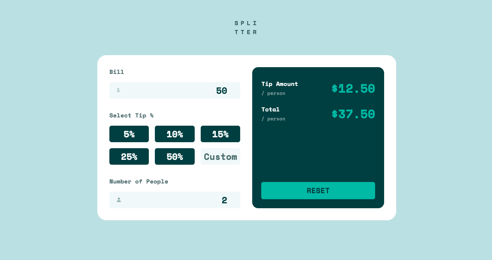

# splitter
Small tip calculator app to help manage splitting the bill amongst friends and family!

## Demo
[Live Demo](https://nc-splitter.netlify.app/)

## Built with
- JavaScript
- TailwindCSS
- HTML
- Vite

## Features
- [x] View the optimal layout for the app depending on their device's screen size
- [x] See hover states for all interactive elements on the page
- [x] Calculate the correct tip and total cost of the bill per person

## Running this Project Locally
From the repo:
1. Clone this project locally
2. Open the project in your preferred code editor
3. Open your terminal and `cd` to the project directory
4. Run `npm install` to install all relevant dependencies
5. Run `npm run dev` to start a dev server and view the project in your browser

## DevDependencies:
- TailwindCSS
- Vite
